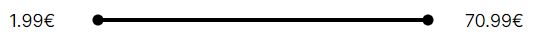

<h1 align="center" >
<strong>RANGE EXERCISE</strong>
 <br>

</h1>

- [Overview](#overview)
- [Pre-requisites](#pre-requisites)
- [Getting Started](#getting-started)
- [Usage](#usage)
- [Project Structure](#project-structure)
- [Technologies](#technologies)
- [Testing](#testing)
- [Practical Use Cases](#practical-use-cases)
- [Contact](#contact)

## Overview

The solution to this exercise has been created using Next.js 13. The project consists of a `<Range />` component that allows selecting a price range with two possible modes. For the demonstration of both modes, the routes exercise1 and exercise2 are provided:

- Exercise1: The `<Range />` component receives maximum and minimum limits within which any two values can be selected.

- Exercise2: The `<Range />` component receives a finite series of values that can be selected.

## Pre-requisites

- Node >= 16.14.0

## Getting Started

1. Clone this project

```bash
   git clone <project_url>
```

2. Navigate to the project directory and install dependencies

```bash
   npm install
```

3. Start the project in development mode or run the production build:

```bash
   npm run dev
   # or
   npm run build
   npm start
```

4. Open [http://localhost:8080](http://localhost:8080) with your browser.

Note: Production environment variables have not been included. Default values will be used for `rangeLimits` and `rangeValues` in production.

## Usage

The `<Range />` component can be used in two modes:

- Exercise1: Drag the bullets or click on the inputs to select a new value. The value will be formatted into currency format when the input loses focus.

- Exercise2: Drag the bullets to select a new value. Upon releasing the bullet, the closest available value to the current position will be selected.

An additional feature has been added for both modes, so that clicking on the track places the nearest bullet in the selected position. The last dragged bullet will always be rendered above the other along the Z-axis to handle cases where their positions coincide.

## Project Structure

This project has been created from scratch, without using `create-next-app`. Instead, the framework and necessary dependencies have been installed, and the App Router structure recommended by Next.js 13, along with its configuration files, has been replicated. Components, utils, custom hooks and constants that can be reused in the application have been included in the `src` folder.

```bash
├── ...
├── src
│ ├── app
│ ├── components
│ ├── customHooks
│ ├── utils
│ └── constants.ts
└── ...
```

Components that are used only in a specific page or layout are included within the `app` folder (e.g. `<Navbar />`).

The styles that are common to the entire application are included in the `src/app/globals` file while styles corresponding to a component are located in its own folder. Similarly, unit test files are located in the same path as the component they refer to.

## Technologies

The project has been created with the following technologies:

- Next.js 13
- React 18
- Typescript
- CSS Modules
- Jest / Testing library

The API has been built in Next.js as well.

Note: Next.js [documentation](https://nextjs.org/docs/app/building-your-application/testing/jest) recommends using E2E tests for asynchronous components. However, in this case, in order to perform unit tests on asynchronous components, the component will be resolved using the `utils/resolvedComponent` function.

## Testing

You can use the following scripts:

```bash
npm run test
# or
npm run test:coverage
# or
npm run test:watch
```

## Practical Use Cases

The `<Range />` component can be used as a controlled component. The `extraExercise` route has been included to showcase its behavior in this scenario. Additionally, support for mobile devices has been implemented in this component. To test it, you can utilize the browser's device change feature and reload the page.

All reusable `components` are provided with BEM-named classes to allow customization by class in a practical example.

## Contact

You can reach me at: [alfonso.martinez.cabanillas@gmail.com](mailto:alfonso.martinez.cabanillas@gmail.com)
